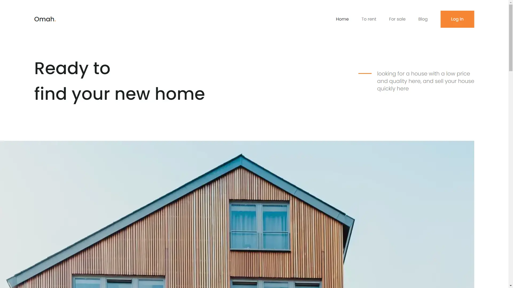

# Omah Landing Page | Next.js 14, React, Typescript, Shadcn UI, Tailwind CSS

This website is the result of slicing design from [Code Design Dev Omah](https://codedesign.dev/challenge/omah).<br />
and this website is completely unresponsive, due to a lack of reference from design or experience related to visual design.

## Demo
<figure>
  
</figure>

## Prerequisites
Node version 20.x.x

## Cloning the repository
```bash
git clone  https://github.com/weiwei2694/bubble-bash.git
cd bubble-bash
```

## Install packages
```bash
npm install
```

## Start the app
```bash
npm run dev
```

## Available commands
| Command                | Description                              |
| ---------------------- | ---------------------------------------- |
| `npm run dev`          | Starts a development instance of the app |
| `npm run build`        | Builds the app for production            |
| `npm run start`        | Starts the app in production mode        |
